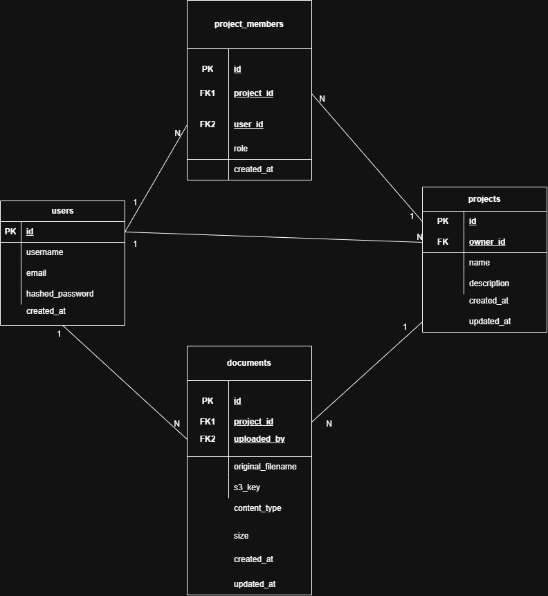

# Project Management Dashboard

A RESTful backend service for managing projects, documents, and user access permissions.

This project is developed using **FastAPI** and follows a layered architecture. It provides authentication, project management, document storage, and project sharing functionality.

---

## 🚀 Features

- User registration and authentication (JWT)
- Create, update, and delete projects
- Upload, download, and delete project documents
- Share projects with other users
- AWS S3 integration for file storage
- AWS Lambda for project size calculation
- PostgreSQL database
- Docker support
- CI/CD with GitHub Actions

---

## 🛠️ Tech Stack

- Python 3.12+
- FastAPI
- PostgreSQL
- SQLAlchemy
- Alembic
- Docker & Docker Compose
- AWS S3
- AWS Lambda
- Pytest
- GitHub Actions

---

## 📁 Project Structure

```text
project-management-dashboard/
│
├── app/
├── alembic/
├── tests/
├── lambda_functions/
├── .github/
├── Dockerfile
├── docker-compose.yml
├── requirements.txt
└── README.md
```

---

## ⚙️ Installation

Clone the repository:

```bash
git clone https://github.com/dilekcolak/project-management-dashboard.git
```

Go to the project directory:

```bash
cd project-management-dashboard
```

Create a virtual environment:

```bash
python -m venv .venv
```

Activate the virtual environment.

Windows:

```powershell
.venv\Scripts\Activate.ps1
```

Linux / macOS:

```bash
source .venv/bin/activate
```

Install dependencies:

```bash
pip install -r requirements.txt
```

---

## ▶️ Run the application

```bash
uvicorn app.main:app --reload
```

Application:

```
http://127.0.0.1:8000
```

Swagger UI:

```
http://127.0.0.1:8000/docs
```

ReDoc:

```
http://127.0.0.1:8000/redoc
```

---

## 🗄️ Database Design

The application uses a relational PostgreSQL database designed according to Third Normal Form (3NF).

### Tables

#### Users

Stores user account information.

| Column          | Description                |
| --------------- | -------------------------- |
| id              | Primary key                |
| username        | Unique username            |
| email           | Unique email address       |
| hashed_password | Hashed user password       |
| created_at      | Account creation timestamp |

---

#### Projects

Stores project information.

| Column      | Description                |
| ----------- | -------------------------- |
| id          | Primary key                |
| name        | Project name               |
| description | Project description        |
| owner_id    | Project owner (FK → Users) |
| created_at  | Creation timestamp         |
| updated_at  | Last update timestamp      |

---

#### Project Members

Manages project access permissions.

| Column     | Description                   |
| ---------- | ----------------------------- |
| id         | Primary key                   |
| project_id | FK → Projects                 |
| user_id    | FK → Users                    |
| role       | owner / participant           |
| created_at | Membership creation timestamp |

---

#### Documents

Stores metadata for documents uploaded to AWS S3.

| Column            | Description                |
| ----------------- | -------------------------- |
| id                | Primary key                |
| project_id        | FK → Projects              |
| uploaded_by       | FK → Users                 |
| original_filename | Original uploaded filename |
| s3_key            | Object key in AWS S3       |
| content_type      | MIME type                  |
| size              | File size in bytes         |
| created_at        | Upload timestamp           |
| updated_at        | Last update timestamp      |

## 🔗 Database Relationships

- One user can own multiple projects (One-to-Many).
- One project has exactly one owner.
- Users and projects are connected through the `project_members` junction table (Many-to-Many).
- One project can contain multiple documents (One-to-Many).
- Each document belongs to exactly one project.

## 📚 Database Normalization

The database schema follows Third Normal Form (3NF).

### First Normal Form (1NF)

- Every table has a primary key.
- Every column contains atomic values.
- No repeating groups or multi-value attributes exist.

### Second Normal Form (2NF)

- Every non-key attribute depends on the entire primary key.
- User, project, membership, and document information are separated into different tables.

### Third Normal Form (3NF)

- Non-key attributes depend only on the primary key.
- Duplicate information is avoided by using foreign keys.
- Project membership is implemented through the `project_members` junction table to resolve the many-to-many relationship between users and projects.

## 📊 Database Schema

The following Entity Relationship Diagram (ERD) illustrates the PostgreSQL database design and relationships between the tables.



## 🧪 Running Tests

```bash
pytest
```

---

## 📌 Project Status

🚧 This project is currently under development.
